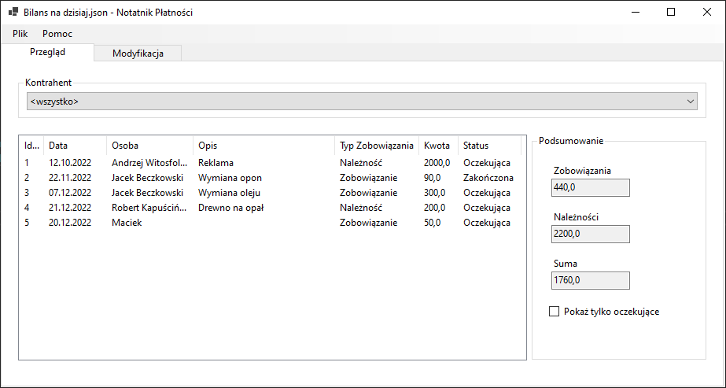

PL:

# Notatnik Płatności
Ten program pozwala na dokumentowanie płatności, zarówno oczekujących jak i zrealizowanych, oraz szybkie zliczanie sumarycznego bilansu zobowiązań oraz należności dla całego arkuszu lub dla wyznaczonej osoby.

Program został napisany w języku C# 10 oraz wykorzystuje paczkę NuGet Newtonsoft.Json w wersji 13.0.1.

## Wymagania:
- Windows 7
- .NET Desktop Runtime wersja 6.0.8 lub późniejsza

## Instalacja:
Pobierz plik [Payment Notebook.zip](https://github.com/PiotrMatczak/PaymentNotebook/blob/main/Payment%20Notebook.zip), wypakuj do wybranej lokalizacji i uruchom plik PaymentNotebook.exe. 

## Instukcja Obsługi:
Zakładka "Przegląd" pozwala na podejrzenie pozycji w arkuszu. Wybór kontrahenta z rozwijanej listy zawęzi wyświetlane wyniki do jednej osoby.
Liczba w okienku "Suma" jest obliczana poprzez odjęcie wyświetlanych zobowiązań od należności.

Aby dodać nowy wpis, w zakładce "Modyfikacja" należy wybrać "\<nowa pozycja\>" z listy, wpisać wymagane dane w pola oraz zatwierdzić przyciskiem "zapisz".

Identyfikator jest przyznawany każdej transakcji automatycznie i zależy od kolejności wprowadzanych transakcji

Program uwzględnia wielkość liter - "Jan Kowalski" będzie uznawany za inną osobę niż "jan kowalski".

